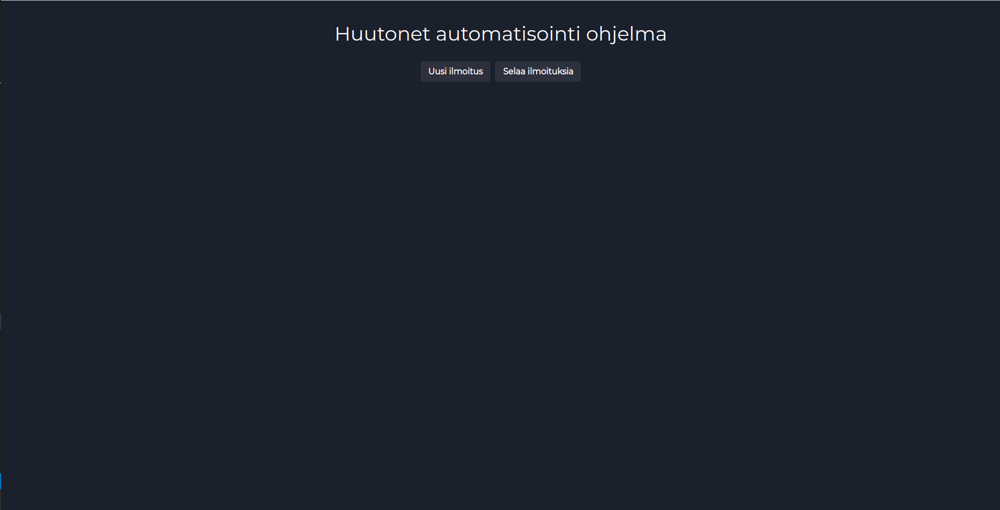
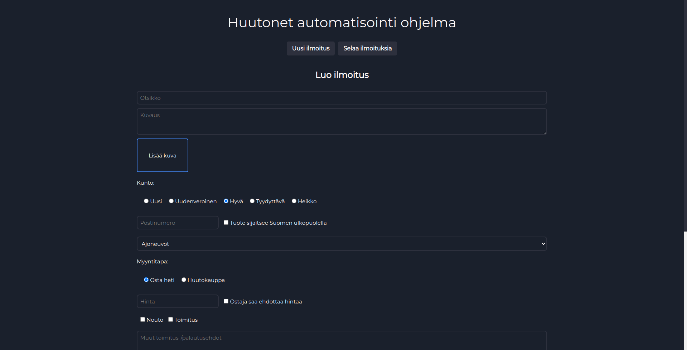
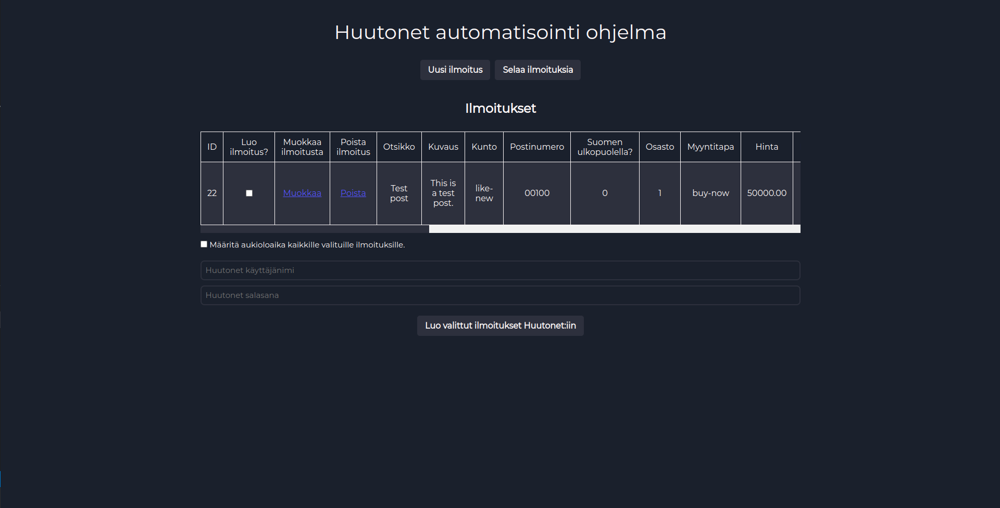
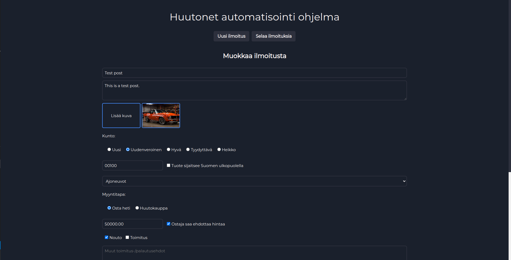

<h1>Huutonet automatization program</h1>
<h2>About</h2>

  This is a program for publishing posts to <a href='https://huuto.net'>Huutonet</a> 
  that I created for a relative. The goal of the program is to help with the post 
  management and is a solution for easily re-publishing existing posts to Huutonet.
  With this program the user can create, edit and delete posts which are saved
  in a database.
  The saved posts can then be selected from a browse posts page where the post
  active time can be chosen and then with a single button click the program will
  use the Huutonet API to publish the selected posts on Huutonet.
  The user interface of the program is in Finnish.
  This program doesn't save the authentication (username & password) to Huutonet
  which are needed for publishing the posts because that is against the terms of
  usage of the Huutonet API.
  This program has no fee for usage and is completely free to use.
  I'm not planning to host this application myself and the user will need to
  self-host the application and the database locally.

<h2>How to use</h2>

  Posts can be created with a form where the user will input all the necessary
  information about the post.
  The created posts can then be edited if needed and also deleted.
  In the browse posts page the user can then select which posts to publish to
  Huutonet and specify a start active time and stop active time for the post.
  Before publishing the program will ask for the username and password used in
  Huutonet, these details are not saved by the program and will always be neeeded
  to be typed again in the publishing process.

<h2>Project Languages</h2>
<ul style='font-size 16px;'>
  <li>PHP 8.2.0</li>
  <li>JavaScript ES6</li>
  <li>Sass 8.0.0</li>
</ul>
<h2>External APIs used by program</h2>
<ul style='font-size: 16px;'>
  <li><a href='https://dev.huuto.net/index.html'>Huutonet API</a></li>
</ul>
<h2>Screenshots of the program</h2>
<h3>Home</h3>

<h3>Create post</h3>

<h3>Browse posts</h3>

<h3>Edit post</h3>

